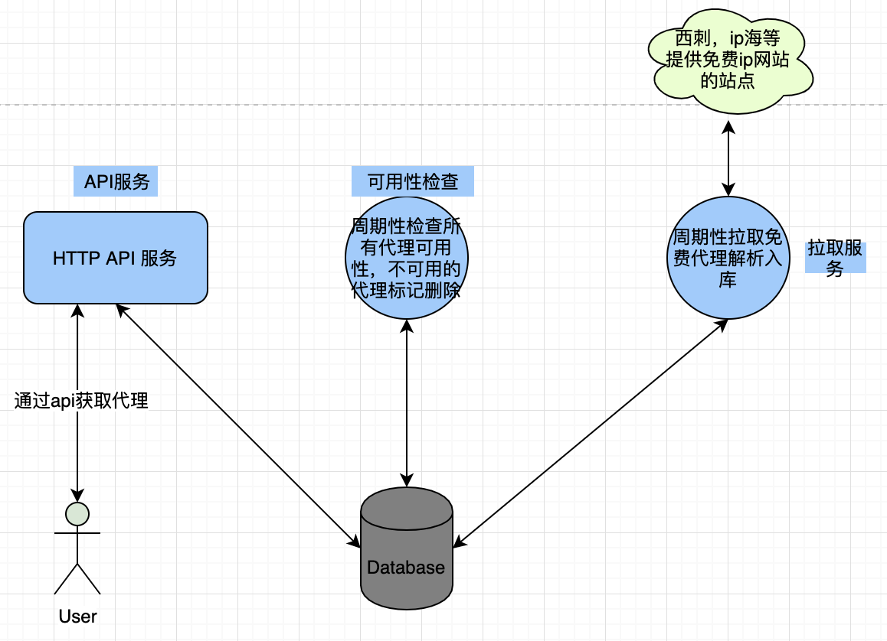

# 关于代码结构
### 设计
代理池的代码主体分为3部分

#### API 服务
http 接口服务对应main文件  `cmd/api/main.go`，使用`gin`框架做接口服务。

#### 周期检查代理可用性服务
周期性检查所有代理的可用性使用，检查可用性的原理：通过代理发送请求到httpbin.org，
检查是否正常响应

#### 周期拉取并解析免费代理服务
主要功能是从各个提供免费代理的站点，爬取免费的proxy，然后进行检查后入库

### 代码目录结构
```bash
.
├── api         # 接口相关代码
│   ├── api.go
│   ├── eno.go
│   └── service.go
├── check          # 检查ip可用性部分代码
│   ├── check.go
│   ├── check_test.go
│   └── validators.go
├── cmd            # 主程序启动文件
│   ├── api
│   │   └── main.go
│   └── scheduler
│       └── main.go
├── config         # 配置文件解析及配置文件
│   ├── conf.yaml
│   ├── config.go
│   └── config_test.go
├── databases      # 数据库链接及orm初始化
│   ├── databases.go
│   └── databases_test.go

├── docs           # readthedocs 文档
│   ├── about.md
│   ├── index.md
│   └── software.md
├── fetch          # 拉取并解析免费代理相关代码
│   ├── common.go
│   ├── fetch.go
│   └── fetch_test.go
├── go.mod
├── go.sum
├── mkdocs.yml    # readthedocs mkdocs 文档配置文件
├── model         # model 定义相关
│   ├── common.go
│   ├── httpbin.go
│   └── proxy.go
├── pkgs          # 通用代码库
└── schema.sql    # 数据库表结构定义文件
├── Dockerfile    # dockerfile
├── docker-compose.yaml # docker-compose 文件
├── LICENSE       #  mit license
├── README.md     # README
├── build.sh      # build脚本
```
